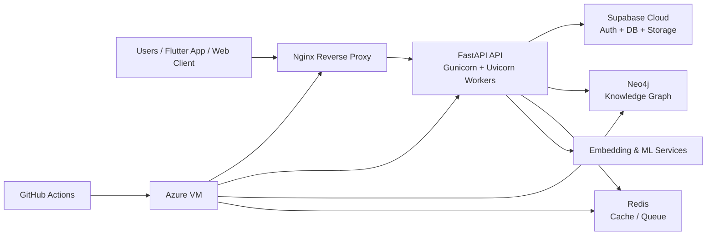
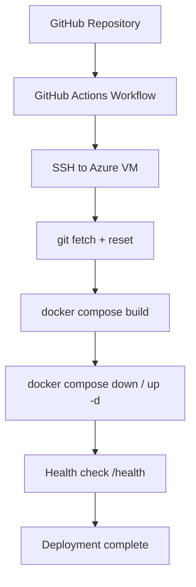

# Proposed System Architecture

## Purpose

This document proposes the backend system architecture for KTUfy based on the current deployment setup and implementation status in this repository.

## Current Deployment Anchor

The repository already follows a container-based deployment pattern:

- GitHub Actions triggers deployment on push to `v3.0_test`.
- The Azure VM pulls the latest code and rebuilds the Docker stack.
- Nginx sits at the edge and forwards traffic to the FastAPI backend.
- FastAPI runs behind Gunicorn with Uvicorn workers.
- Neo4j and Redis run as internal services in the same Docker network.
- Supabase remains cloud-hosted for auth, database, and storage.

## Proposed High-Level Architecture

## Runtime Layers

### 1. Client Layer

Clients consume the API over HTTP/HTTPS. The expected consumers are:

- Flutter mobile client
- Any web frontend or admin interface
- Direct API consumers during testing

### 2. Edge Layer

Nginx is the public entry point.

Responsibilities:

- TLS termination when HTTPS is enabled
- Reverse proxying to the backend container
- Basic rate limiting
- Request buffering and large upload handling
- Health-check forwarding

### 3. Application Layer

FastAPI is the main application layer.

Responsibilities:

- Authentication and user APIs
- Chat and content-generation APIs
- Syllabus, flashcard, learning, coding, media, and ticklist routes
- Admin routes and the admin dashboard
- Health and status endpoints

Runtime model:

- Gunicorn manages process workers
- Uvicorn workers handle ASGI traffic
- The app listens on internal port `8000`

### 4. Data and Service Layer

The backend depends on multiple supporting services:

- Supabase for auth, relational data, and storage
- Neo4j for the knowledge graph and KG-RAG flows
- Redis for cache and future queue/workflow support
- Local persistent volumes for uploads, vector store data, and Neo4j data

### 5. ML / Retrieval Layer

The backend also includes internal AI and retrieval services:

- Embedding generation for syllabus content
- Query routing across KG and vector paths
- LLM-backed generation and extraction flows
- PDF and media processing services

## Deployment Topology

## Proposed Production Flow

1. Developer pushes to the deployment branch.
2. GitHub Actions runs the test job.
3. If tests pass, the workflow SSHs into the Azure VM.
4. The VM fetches the latest branch state.
5. Docker Compose rebuilds the backend image.
6. Containers restart in a clean state.
7. Nginx routes traffic to the backend service.
8. The health endpoint confirms the backend and dependent services are ready.

## Service Responsibilities

| Service | Role | Exposure |
|---|---|---|
| Nginx | Public reverse proxy | Public `80/443` |
| FastAPI backend | API and business logic | Internal `8000` |
| Neo4j | Knowledge graph store | Internal to Docker network, optionally admin ports exposed for ops | 
| Redis | Cache / queue support | Internal only |
| Supabase | Auth, relational DB, storage | External cloud service |
| Azure VM | Host for the container stack | Infrastructure layer |
| GitHub Actions | Test and deploy automation | CI/CD layer |

## Network Boundaries

Recommended boundaries:

- Public internet reaches only Nginx.
- Nginx can reach the backend over the Docker network.
- The backend can reach Neo4j, Redis, and external Supabase endpoints.
- Admin-only or debug endpoints should remain behind backend authentication.

## Health Model

The current `/health` endpoint is a good operational contract.

It should represent:

- API availability
- Authentication readiness
- Neo4j connectivity
- Embedding service readiness
- Storage availability

That makes the deploy workflow’s final curl check a meaningful release gate.

## Recommended Improvements

These are useful next steps, but they do not change the base topology:

- Replace wildcard CORS with explicit allowed origins.
- Add real pytest execution in the CI test job.
- Add structured logging and request correlation IDs.
- Add Redis-backed caching for expensive LLM and retrieval calls.
- Introduce monitoring for health, error rates, and container restarts.
- Consider separate worker scaling if async processing grows.

## Summary

The proposed architecture is a containerized Azure VM deployment with Nginx as the edge layer, FastAPI/Gunicorn as the application layer, Neo4j and Redis as internal dependencies, and Supabase as the managed cloud backend for auth, DB, and storage.

This matches the repository’s current deployment path and gives a clean foundation for scaling the system without changing the core topology.
